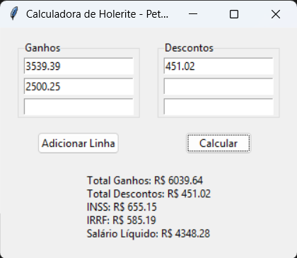

# Holerite v0.1  

Esta é uma calculadora simples de Holerite desenvolvida em Python.  
Ela faz o cálculo da soma de várias instâncias de ganhos e descontos. Depois é aplicado os valor correto de desconto de INSS e IRRF (Desconto simplificado).  
  
:construction:  Projeto em construção  :construction:
  
## Funcionalidades  
- Permite colocar várias instâncias diferentes de entradas (salários, rendimentos etc.);  
- Faz o cálculo correto do IRRF e INSS, útil para quem possui mais de uma folha de pagamento em que cada uma está nas faixas de desconto mais baixas, porém quando somadas ultrapassa faixas de desconto mais altas.
  
## Como usar  
1. Faça o Download dos aplicativos "aliquotas.exe" e "holerite.exe";  
2. Execute o aplicativo "aliquotas.exe" pela primeira vez para gerar a tabela com as faixas de descontos vigentes;  
3. Execute o aplicativo "holerite.exe" para ter acesso a calculadora;  
4. Insira todas as instâncias de Ganhos e Descontos e clique em "Calcular" :warning: Utilize pontos (.) como separadores de casas decimais;  
5. Após calcular, o resultado dos valores descontados em IRRF e INSS e o valor de salário líquido serão demonstrados;  
  
## Interface  
  

## Sobre o Autor  
Desenvolvido por Petérquio - dfmorgs@gmail.com  
LinkedIn - [Diego Morgado](https://www.linkedin.com/in/diego-morgado-145ab912b/])  

:balance_scale: **MIT license**
